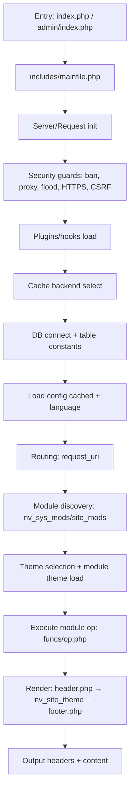
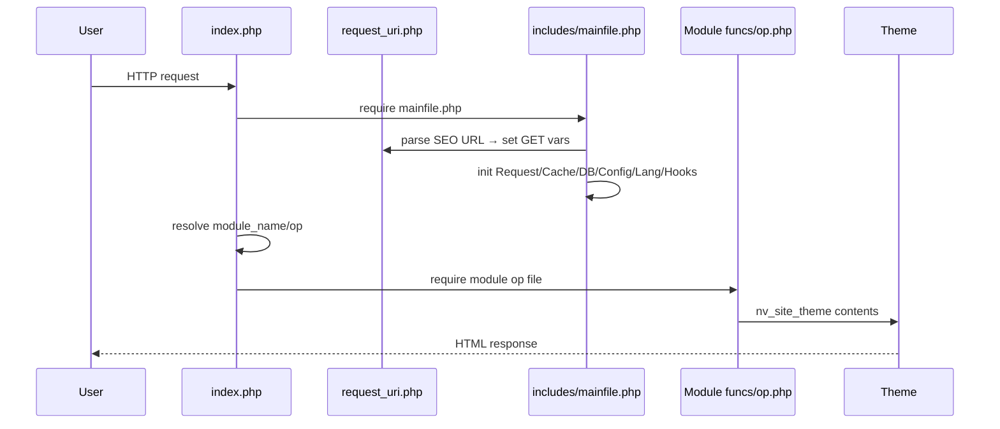
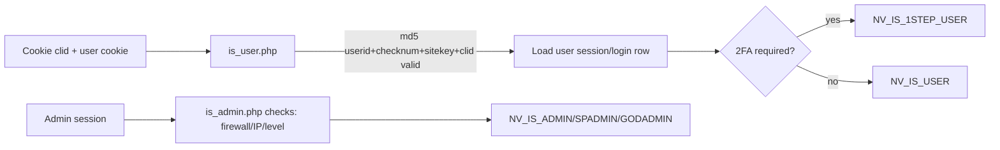

## NukeViet Framework Architecture – Comprehensive Analysis (v5.x)

### Executive Summary
NukeViet is a modular PHP CMS with a clear entrypoint → bootstrap → routing → module execution → theming → response lifecycle. Core services are centralized in includes/mainfile.php: request normalization, security guards, plugin hooks, configuration loading, caching, database connections, language bootstrapping, and theme/CDN setup. Modules live under modules/<name> and expose funcs/* operations rendered via themes/<theme>. The system provides:
- Robust routing (query and SEO rewrite) with NV_NAME_VARIABLE/NV_OP_VARIABLE/NV_LANG_VARIABLE
- A PDO-based Database abstraction with a small fluent query builder
- Two templating engines: XTemplate (frontend) and Smarty (admin)
- Authentication/authorization with multi-level admin roles and optional two-step verification
- Configuration persisted in DB and aggressively cached
- Pluggable hooks/events at well-defined “sectors” and stages

---

### Directory Structure Overview (selected)
- index.php – Frontend entrypoint; routes to modules
- admin/index.php – Admin entrypoint; module-based admin UI
- includes/
  - mainfile.php – Core bootstrap and lifecycle
  - request_uri.php, request_uri_admin.php – URL parsing and SEO rewrite
  - functions.php – Utilities, module discovery, hooks, helpers
  - core/* – Security, captcha, cron, flooding guard, header/footer, etc.
  - vendor/vinades/nukeviet/* – Core classes (Database, Request, Server, Cache, Error, Template)
  - xtemplate.class.php – XTemplate engine
- modules/<module> – Feature modules (funcs/, admin/, theme.php, functions.php, version.php, ...)
- themes/<theme> – Frontend themes; admin themes in themes/admin_*
- assets/, uploads/, data/ – Static resources, user content, cache/config/logs

---

### Main Entry Points and Bootstrap
- Frontend: index.php defines NV_SYSTEM and requires includes/mainfile.php, then resolves module/op and executes the module op file.
- Admin: admin/index.php defines NV_ADMIN and reuses the same bootstrap; it then checks admin session/permissions and dispatches to the admin module.

**index.php** - Frontend entry point:
```php
define('NV_SYSTEM', true);
define('NV_ROOTDIR', pathinfo(str_replace(DIRECTORY_SEPARATOR, '/', __FILE__), PATHINFO_DIRNAME));
require NV_ROOTDIR . '/includes/mainfile.php';
// ... determine $module_name, $op and include module op file
```

**includes/mainfile.php** - Core bootstrap:
```php
// Hook sector 1
nv_apply_hook('', 'sector1');
// Start DB session
$db = $db_slave = new NukeViet\Core\Database($db_config);
$nv_Cache->SetDb($db);
// Load settings to $global_config, $module_config from DB (cached)
```

Bootstrap highlights (includes/mainfile.php):
1) Constants/config, vendor autoload, server detection (Server), request normalization (Request)
2) Security: IP/proxy bans, anti-CSRF origins, flood blocker, captcha, CSP, HTTPS redirect
3) Plugins/hooks load; CDN/static URL setup; Cache backend selection
4) Database connect; table constants; configuration loading via cached queries
5) Language loading; theme/CDN configs; cron launcher; async email; bot meta manager
6) Site closure/update guard; module discovery (nv_sys_mods)

---

### Routing and Request Handling
- Variables: NV_NAME_VARIABLE=nv, NV_OP_VARIABLE=op, NV_LANG_VARIABLE=language (includes/constants.php)
- Request URI handling parses SEO-friendly URLs and fills GET vars accordingly; supports optional ext url suffix and language-in-path.

**includes/request_uri.php** - URL parsing:
```php
if (preg_match('/^' . $base_siteurl_quote . '([a-z0-9\-_.\/\+]+)(' .
    nv_preg_quote($global_config['rewrite_endurl']) . '|' .
    nv_preg_quote($global_config['rewrite_exturl']) . ')$/i', $request_uri, $m)) {
    $arr = explode('/', $m[1], 3);
    if (in_array($arr[0], array_keys($language_array), true)) {
        $_GET[NV_LANG_VARIABLE] = $arr[0];
        isset($arr[1][0]) && ($_GET[NV_NAME_VARIABLE] = $arr[1]);
        isset($arr[2][0]) && ($_GET[NV_OP_VARIABLE] = $arr[2]);
    }
}
```

Request class centralizes env, cookies, sessions, headers and security checks:
- Origin/Referer validation, cookie domain/path, session id, site_url, headerstatus
- Helpers: get_string/get_int/get_title, set_Cookie, set_Session, security_post_get

---

### Module System: Discovery, Loading, Execution
- Modules registered in NV_PREFIXLANG_modules and NV_PREFIXLANG_modfuncs; discovered via nv_sys_mods(), filtered for visibility by nv_site_mods().

**includes/functions.php** - Module discovery:
```php
function nv_sys_mods($lang = '') {
    $result = $db->query('SELECT m.*, f.func_id, f.func_name, f.alias, ...');
    while ($row = $result->fetch()) {
        $sys_mods[$row['title']]['funcs'][$row['alias']] = [
            'func_id' => $row['func_id'], 'func_name' => $row['func_name'], ...
        ];
        $sys_mods[$row['title']]['alias'][$row['func_name']] = $row['alias'];
    }
}
```

Frontend dispatch (index.php):
- Resolve $module_name, $op; guard with regex; map to funcs/<op_file>.php; require module theme/functions if present

**index.php** - Module execution:
```php
$op_file = $module_info['funcs'][$op]['func_name'];
require NV_ROOTDIR . '/modules/' . $module_file . '/funcs/' . $op_file . '.php';
```

Module layout conventions (typical):
- admin/, admin.functions.php, admin.menu.php – Admin UI for the module
- funcs/ – Frontend operations (each op in its own file)
- theme.php – Frontend view helpers for the module
- functions.php – Module-level shared helpers
- language/, blocks/, widgets/, version.php, search.php (optional per module)

---

### Template/Theme System and View Rendering
- Frontend uses XTemplate; Admin uses Smarty via NukeViet\Template\NVSmarty.
- Rendering pattern in ops: include header.php, echo nv_site_theme($contents), include footer.php.

**modules/page/funcs/main.php** - Standard rendering pattern:
```php
include NV_ROOTDIR . '/includes/header.php';
echo nv_site_theme($contents);
include NV_ROOTDIR . '/includes/footer.php';
```

Theme resolution (index.php): select module theme folder under themes/<theme>/modules/<module_theme>, fallback to default.

**index.php** - Theme resolution:
```php
$module_info['template'] = $global_config['module_theme'];
if (!theme_file_exists($global_config['module_theme'] . '/modules/' . $module_info['module_theme'])) {
    if (theme_file_exists('default/modules/' . $module_info['module_theme'])) {
        $module_info['template'] = 'default';
    }
}
```

NVSmarty auto-assigns common constants to templates:

**includes/vendor/vinades/nukeviet/Template/NVSmarty.php** - Auto-assigned constants:
```php
$this->setCompileDir(NV_ROOTDIR . '/' . NV_CACHEDIR . '/smarty-compile');
$this->assign('NV_BASE_SITEURL', NV_BASE_SITEURL);
$this->assign('NV_LANG_DATA', NV_LANG_DATA);
$this->assign('ASSETS_STATIC_URL', ASSETS_STATIC_URL);
```

---

### Database Abstraction and Data Access
- NukeViet\Core\Database extends PDO and configures driver options, DSN, session timezone; exposes a minimal fluent query builder (sqlreset(), select(), from(), where(), order(), limit(), offset(), sql()).

**includes/vendor/vinades/nukeviet/Core/Database.php** - Database class:
```php
class Database extends PDO { public $connect=0; ... }
public function __construct($config) {
    $dsn = $config['dbtype'] . ':dbname=' . $config['dbname'] . ';host=' . $config['dbhost'] . ';charset=' . $config['charset'];
    parent::__construct($dsn, $config['dbuname'], $config['dbpass'], $driver_options);
}
```

Query builder usage example from modules:

**modules/page/funcs/main.php** - Query builder example:
```php
$db_slave->sqlreset()->select('*')->from(NV_PREFIXLANG . '_' . $module_data)
    ->where('status=1 AND id !=' . $id)->order('weight ASC')->limit($related_articles);
$result = $db_slave->query($db_slave->sql());
```

---

### Authentication and Authorization
- Frontend user detection (includes/core/is_user.php) validates signed cookies and session against DB; defines NV_IS_USER or NV_IS_1STEP_USER (if 2FA required but not activated).

**includes/core/is_user.php** - User authentication:
```php
if ($user_cookie['checkhash'] === md5($user_cookie['userid'] . $user_cookie['checknum'] .
    $global_config['sitekey'] . $client_info['clid'])) { /* load and verify */ }
```

- Admin detection (includes/core/is_admin.php) verifies session, firewall/IP, admin level, and sets:
  - NV_IS_ADMIN – admin authenticated
  - NV_IS_SPADMIN – super admin
  - NV_IS_GODADMIN – god admin (top-level)

**includes/core/is_admin.php** - Admin level detection:
```php
define('NV_IS_ADMIN', true);
if ($admin_info['level'] == 1 || $admin_info['level'] == 2) define('NV_IS_SPADMIN', true);
if ($admin_info['level'] == 1 && $global_config['idsite'] == 0) define('NV_IS_GODADMIN', true);
```

---

### Configuration Management
- Config values live in NV_CONFIG_GLOBALTABLE and are read into $global_config and $module_config, cached via $nv_Cache->db(..., 'settings').

**includes/mainfile.php** - Configuration loading:
```php
$sql = 'SELECT lang, module, config_name, config_value FROM ' . NV_CONFIG_GLOBALTABLE .
       " WHERE lang='" . NV_LANG_DATA . "' or (lang='sys' AND (module='site' OR module='banners'))";
$list = $nv_Cache->db($sql, '', 'settings');
foreach ($list as $row) { /* populate $global_config/$module_config */ }
```

---

### Caching Mechanisms
- Backends: Files (default), Memcached, Redis; selected by $global_config['cached'] during bootstrap.

**includes/mainfile.php** - Cache backend selection:
```php
if ($global_config['cached'] == 'memcached') {
    $nv_Cache = new NukeViet\Cache\Memcached(...);
} elseif ($global_config['cached'] == 'redis') {
    $nv_Cache = new NukeViet\Cache\Redis(...);
} else {
    $nv_Cache = new NukeViet\Cache\Files(...);
}
```

- Common patterns: $nv_Cache->db($sql, $keyfield, $module) for DB query caching; getItem/setItem for arbitrary cache blobs; cache invalidation via delMod/delAll.
- Example: Module function layout caching (index.php) caches $module_info['layout_funcs'] per theme.

---

### Hook/Event System
- Register with nv_add_hook(module_name, tag, priority, callback, hook_module, pid)
- Apply with nv_apply_hook(module, tag, args, default, return_type)
- Return types: default last value; 1: array_merge; 2: array_merge_recursive

**includes/functions.php** - Hook application:
```php
function nv_apply_hook($module, $tag, $args = [], $default = null, $return_type = 0) {
    foreach ($nv_hooks[$module][$tag] as $priority_funcs) {
        foreach ($priority_funcs as $func) {
            $_value = call_user_func_array($func['callback'], [&$args, $from_data, $receive_data]);
            /* merge/assign into $value per $return_type */
        }
    }
    return $value ?? $default;
}
```

Notable hook points:
- sector1 (pre-DB), sector2 (post-module discovery), sector3 (pre-output), check_server, modify_global_config, change_site_buffer; admin UI theme hooks: get_global_admin_theme, get_module_admin_theme.

---

### Application Lifecycle (Request → Response)



### Module Loading Sequence



### Authentication Flow (simplified)



---

### Key Files and Their Purposes
- index.php – Frontend controller; module/op resolve and execution
- admin/index.php – Admin controller; admin module dispatch
- includes/mainfile.php – Bootstrap core services and lifecycle
- includes/request_uri.php – SEO URL to GET mapping
- includes/functions.php – Core utilities: module discovery, hooks, caching helpers
- includes/vendor/vinades/nukeviet/Core/Request.php – Input, headers, sessions, security
- includes/vendor/vinades/nukeviet/Core/Database.php – PDO wrapper + query builder
- includes/vendor/vinades/nukeviet/Cache/* – Cache backends
- includes/xtemplate.class.php, Template/NVSmarty.php – Templating engines
- includes/core/is_user.php, is_admin.php – Auth detection and role flags
- includes/header.php, footer.php – Output buffering, header assembly, optimization

---

### Architectural Patterns and Conventions
- Single bootstrap (mainfile.php) shared across frontend/admin
- Convention-over-configuration module layout; op → funcs/<op_file>.php
- Constants as public contract (NV_* variable names, dirs, cookie names)
- Defensive coding: validate inputs via Request; regex guards for module/op
- Caching first: $nv_Cache->db() for config and common queries; cache invalidation on change
- Hookable extension points for cross-cutting concerns (CDN, CSP, rewrite, admin theme)
- Theming separation: global theme.php + module theme.php; fallback to default
- Language-first: NV_LANG_DATA/NV_LANG_INTERFACE and language packs under includes/language/

---

### Best Practices Observed
- Always use $nv_Request for accessing GET/POST/COOKIE/SESSION to benefit from security filtering
- Guard module/op with regex from $global_config['check_*'] patterns
- Use nv_Cache->db for repeated reads; call $nv_Cache->delMod('<module>') upon writes
- Load language files early (global, then module)
- Keep module ops focused: compute data, call theme rendering, include header/footer
- Use nv_apply_hook to customize behavior without core edits
- Respect mobile/desktop theming and ASSETS_STATIC_URL for performant delivery

---

### Closing Summary
NukeViet’s architecture is a mature, modular CMS design: centralized bootstrap with strict security and config/caching, flexible routing, disciplined module lifecycle, and theme-first rendering. The hook system enables clean extensibility. Adhering to the conventions above ensures compatibility with the core and minimizes maintenance overhead.

